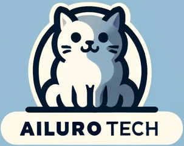

<table width="100%">
<tr>
<td width="50%" valign="middle">

</td>
<td width="50%" align="right" valign="middle">
<strong>Ailurotech Solutions Pty Ltd</strong> 
ABN: 13 673 935 263 
+61 474 212 611 
contact@ailurotech.com.au 
1-13 Sixth Street, Bowden, SA 5007
</td>
</tr>
</table>
# The Shadow - Prototype Agreement

**Version:** 1.1
**Date:** 25 Feb 2025

## Changelog

| Version | Date | Changes |
|---------|------|---------|
| 1.1 | 25 Feb 2025 | Added letterhead, renamed to Prototype Agreement |
| 1.0 | 25 Feb 2025 | Initial draft |

## Brief

The Shadow is a prototype app where users express their feelings through an interface. A curated agent responds with a best-matching archetype and suggestions to help users understand their emotions.

## Client Info

Name: Peter Lord

Email: pete@caro.au

Company: Green Room Venture Pty Ltd

ABN: 37 616 077 475

Address: 79A Brooker Ave Beacon Hill NSW 2100

## Contractor Info

Company: Ailurotech Solutions Pty Ltd

Project Lead: Norris Wu

Primary Contact: work@norriswu.me

Phone Number: 0431 072 313

Address: 1-13 Sixth Street, Bowden, SA 5007

## Deliverables

1. Project setup
   - Codebase - Next.js, shadcn (UI components), Mastra (AI framework)
   - Deployment - Vercel default domain (e.g., `the-shadow-abc123.vercel.app`)

2. Archetype matching agent
   - Configure DeepSeek agent in Mastra
   - Curate prompt to match input to best-fit archetype
   - Returns archetype + description + deeper question + suggestions
   - Test interface for standalone agent validation

   *Note: Client provides archetype definitions via Google Docs at kickoff meeting. Contractor reviews and ports to prototype. Together we define 3 test cases (sample input → expected archetype). Agent tuning complete when test cases pass consistently.*

   *Archetypes provided at kickoff are in scope. Additional archetypes after kickoff quoted separately - may require agent tuning and performance tweaks.*

3. User interface flow
   - Landing page - branding, intro copy, CTA
   - Input page - text input, suggested feeling tags, "Analyze" button
   - Result page - archetype name, description, deeper question, suggestions, "Start over"

   User stories:
   - **Text input:** User types feeling → gets archetype
   - **Suggested feelings:** User selects tags → gets archetype

*Note: Suggested feelings list to be discussed in kickoff meeting. If not finalized, will use wireframe defaults (Lonely, Irritable, Judgmental, Overwhelmed, Empty, Stuck).*

## Use Cases

1. **Express via text**
   User types "I felt enraged when my partner interrupted me" → taps "Analyze my shadow" → sees "Tyrant King" archetype with explanation and suggestions.

2. **Express via suggested feelings**
   User selects [Lonely] + [Stuck] from tags → taps "Analyze my shadow" → sees matched archetype with guidance.

3. **Reflect and restart**
   User reads archetype result, reflects on "deeper question" → taps "Start over" → returns to input page for another session.

## Non-functional Requirement

- Browser: Chrome, Firefox
- Mobile-first design, responsive to desktop

## Estimates and Quote

Hourly rate: ~~$120/hr~~ $100/hr (goodwill rate)

| Item | Hours | Cost |
|------|-------|------|
| Scoping & analysis | 4 | ~~$400~~ waived |
| Setup project | 3 | $300 |
| Agent & matching | 6 | $600 |
| Feeling → archetype flow | 5 | $500 |
| QA | 2 | $200 |
| **Total** | **16** | **$1,600** |

*Fixed price based on estimated hours.*

## Additional In Scope Item

- Development environment setup
- Source code in GitHub repository
- Basic documentation
- Deployment and API costs during development (covered by contractor)
- 2 rounds of UI revisions (additional rounds quoted separately)

*Note: If project proceeds to production, hosting and API costs to be discussed separately.*

## Out of Scope

- Production hosting costs
- Third-party API costs
- Ongoing maintenance
- Features not listed above
- Custom visual design (prototype uses shadcn defaults, presentable but not pixel-perfect)
- Edge case handling (prototype focuses on happy path)

## Communication

- **LinkedIn Chat** - day-to-day text chat
- **Zoom** - discussions and meetings
- **Email** - formal communication

## Timeline

- **Kickoff meeting:** Monday, 2nd March 2026, 8.30am
- **Start:** 2nd March 2026
- **Estimated delivery:** 2 business days from start

*Client to prepare for kickoff: archetype definitions (Google Docs) and confirm suggested feelings list.*

## Payment Terms

- 50% ($800) upfront upon acceptance of this SOW
- 50% ($800) upon completion

*Invoice with payment details to follow upon acceptance.*

## Resource Ownership

During development:
- Hosting account (Vercel) and API keys (DeepSeek) owned by contractor

If prototype stays live beyond 7 days post completion:
- DeepSeek API cost to be transferred to client
- Deployment and codebase transferred upon request

## Intellectual Property

All project IP transfers to client upon final payment. Third-party libraries (shadcn, Mastra, etc.) remain under their respective licenses. Contractor retains right to reuse non-proprietary code patterns.

## Warranty

Bug fixes for delivered functionality covered for 1 month after project completion. Does not cover new features or changes to requirements.

## Change Requests

Scope is confirmed upon acceptance of this SOW. Major changes to be discussed during workflow.

## QA Process

1. Contractor tests all deliverables against use cases
2. Browser check (Chrome, Firefox)
3. Mobile responsiveness check
4. Bugs found → fixed within scope
5. Final walkthrough with client

**QA complete when:**
- All functional requirement checkboxes pass
- No critical bugs on Chrome/Firefox
- Mobile layout works
- Both parties are happy with their money spent/earned

## Completion Criteria

Work is complete when all Deliverable items are checked off and QA is complete.

## Potential Next Step

If core experience validates, a follow-up engagement could include:
- **My Deck** - save archetypes, view history, track patterns over time

*Requires database and user persistence - to be scoped separately.*

## Acceptance

By signing below, both parties agree to the terms outlined in this Prototype Agreement.

**Client - Green Room Venture Pty Ltd**

Name: \_\_\_\_\_\_\_\_\_\_\_\_\_\_\_\_\_\_\_\_\_\_\_\_\_\_\_\_

Signature: \_\_\_\_\_\_\_\_\_\_\_\_\_\_\_\_\_\_\_\_\_\_\_\_\_\_\_\_

Date: \_\_\_\_\_\_\_\_\_\_\_\_\_\_\_\_\_\_\_\_\_\_\_\_\_\_\_\_

**Contractor - Ailurotech Solutions Pty Ltd**

Name: \_\_\_\_\_\_\_\_\_\_\_\_\_\_\_\_\_\_\_\_\_\_\_\_\_\_\_\_

Signature: \_\_\_\_\_\_\_\_\_\_\_\_\_\_\_\_\_\_\_\_\_\_\_\_\_\_\_\_

Date: \_\_\_\_\_\_\_\_\_\_\_\_\_\_\_\_\_\_\_\_\_\_\_\_\_\_\_\_